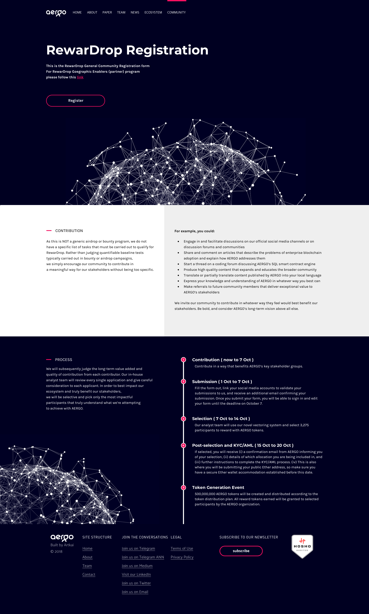

# Diary-Development

배운것부터 프로젝트까지 정리하는 공간

---

# in Blocko

## 배운 것들 (2018.08~2018.11)

1. Wordpress
2. HTML, CSS (퍼블리싱할 기회가 많아서 마크업도 CSS도 많이 좋아졌다. -> Semantic해지고 불필요한 CSS가 줄었다)
3. React, JavaScript(jquery 포함) - (입사전에 비해 굉장히 많이 향상되었다.)
4. Apollo-Client + GraphQL 사용
5. Amazon S3, Cloudfront, EC2, CodeDeploy, Route53
6. 컴퓨터 지식 및 네트워크 인프라 (개념도 없었는데 개념이 조금씩 잡혀가는 중)

---

## 배운 것들 (2018.12~2019.05)

1. Vue.js를 통한 CMS(백오피스) 개발 - 러닝커브가 굉장히 좋아짐을 알수 있었음 (스스로 2~3일 학습 후 개발)
2. EJS, Node.js를 이용하여 웹에서 보여줄 피드 화면 개발 - Node.js 사용을 해보면서 서버쪽에 시야를 얻을 수 있었음
3. React-Native를 이용하여 Dapp 갓츄(Gotchu) 개발 - 처음에는 client 서브였으나, 3월을 기점으로 메인개발 시작
4. 모바일 개발을 접하면서 새로운 분야에 헤딩하면서 극복해나가는 자세를 획득
5. 실제 서비스 배포, 운영, QA, N차 개발을 하면서, 다양한 에러 핸들링과 지식등.. 실력이 많이 향상됨
6. 어떤 기능을 구현하고 싶다는 이야기를 들으면 어떻게 개발할지 머릿속에 코드가 그려지기 시작
7. 효율적인 에러핸들링, 타입체킹 및 테스팅에 대한 고민과 다양한 시도를 해보게 됨 (ts,jest의 사용 도입)
8. slack Chatbot을 만들어보면서 heroku등.. 서버 배포 경험도 쌓아봄
9. 다양한 국적의 사람들과의 협업...

---

## 프로젝트 및 했던 일

Aergo - Rewardrop

사용 기술 : Wordpress(PHP), CSS 

주요 내용 : 워드프레스 테마 제작 및 퍼블리싱(Responsive Web Page) 

프로젝트(포트폴리오) 주소 : 

- https://www.aergo.io/ecosystem/ (만료됨)
- https://www.aergo.io/ecosystem/partners/ (만료됨)
- https://www.aergo.io/community/ (만료됨)
- https://www.aergo.io/legal/#rewardrop-terms-GE (만료됨)
- https://www.aergo.io/legal/#rewardrop-terms-community (만료됨)

##### 당시 사이트 이미지

---

Gotchu Landing Page Open

사용 기술 : HTML, CSS, JavaScript(jquery) 

주요 내용 : 랜딩 페이지 클라이언트 개발(인터랙션 구현 포함), 백엔드 연동 (사전예약 접수하는 기능) 

프로젝트(포트폴리오) 주소 : 

- https://www.gotchu.io/

---

Gotchu Admin CMS Development

사용 기술 : React, CSS, Apollo-Client, GraphQL, ETC (ThirdParty Library..) 

주요 내용 : Gotchu (Aergo DAPP) CMS 클라이언트 개발 (All), 데이터 연동, Client Structure 구성 

프로젝트(포트폴리오) 주소 : 내부용이라 공개 불가 

기억남는 개발 기능 :  

- 서버로부터 데이터를 받아서 그래프로 연동 (chart.js)
- 그래프를 기간별로 설정해서 엑셀(csv)로 추출
- 계정 생성, 코인 생성, 포스트/퀘스트 생성,삭제,수정등.. 필요 기능 구현
- 메인 배너를 고르기 쉽게 Query를 통해 게시물중 일부 추출, 카드형식으로 드래그 앤 드롭하여 등록할 수 있게 UI 구현 (onDrop과 같은 개념 처음 접함)
- 보안적인 부분도 중요하여 클라이언트 개발시 보안적인 부분 신경 많이 씀 (localStorage 대신 sessionStorage 사용 및 SQL injection, XSS등 예방하는 로직 추가)
- 1차 개발후 Vue.js로 포팅, 기존 개발된 소스를 Vue의 코드로 옮김 (Vue.js 사용법 및 React.js에서 사용하던 모듈을 vue에 맞게 수정, 없는 모듈을 직접 구현)

---

Gotchu Influencer Page Development

사용 기술 : HTML(EJS), CSS, jQuery(Client), Node.js(server), graphQL 

주요 내용 : 클라이언트 개발 및 CMS에서 작성한 데이터를 프로모션 페이지로 연동, 모바일/데스크톱 판별해서 Node.js를 통해 알맞는 페이지 및 UI 구현 

프로젝트(포트폴리오) 주소 :  

- https://www.gotchu.io/cjpkt46p4rijj0848zcpks0gu/posts

---

Dapp Gotchu

사용 기술 : React-Native, GraphQL, Apollo-Client... 

주요 내용 : Dapp Gotchu 개발 

프로젝트(포트폴리오) 주소 :  

- https://play.google.com/store/apps/details?id=xyz.blocko.app.gotchu
- https://itunes.apple.com/kr/app/Gotchu/id1442623172

기억남는 개발 에피소드 :  

- 시니어분의 인수인계 (정말 좋아하던 개발자분이셨고, 많이 배웠으며, 모바일을 접해보지 못했지만 그분에게 배우면서 상당부분 빠르게 습득할 수 있었음)
- 코드푸시 연동 (인수인계후 혼자서 앱개발을 하는데 appcenter codepush를 스스로 연동하고 작동시키는데 고생을 많이해서)
- 1.0.2 -> 1.2.0 까지 개발 (돌이켜보면 많이 성장한게 보여짐, 아직 한참 더 성장해야하지만..!!)
- AOS, iOS 심사 맡기고 통과시키기 (iOS의 경우 리젝당하는 경우가 있는데 점점 매끄럽게 대처가 됨)
- 네이티브 모듈의 기능을 수정해서 사용, Xcode를 이용하여 의존성관리 및 개발환경 설정하는등.. 겁나던 것들을 매끄럽게 하게됨
- 모바일 개발자 충원까지 담당이였으나, 리뉴얼까지 개발을 맡게 됨

---

World Premiere

사용 기술 : HTML, CSS, JS... 

주요 내용 : World-Premiere 이벤트 진행 페이지 개발 

프로젝트(포트폴리오) 주소 :  

- https://www.aergo.io/world-premiere/ (만료됨)

##### 당시 사이트 이미지

기억남는 개발 에피소드 :  

- 독일 디자이너와 협업
- 했던 프로젝트 기간중 제일 최단 기간 (개발기간 1.5일)
- 다단 형식으로 FullPage.js같은 인터랙션 구현 (1차요구에 맞게 개발)
- 디자이너가 보고 미디움(medium)과 같은 느낌을 요구 -> 2차 수정
- 조율하여 개발 완료 (36시간 경과)
- Mobile + PC 지원

---

## 사이드 프로젝트

1. Vuestagram 개발

사용 기술 : Vue.js + Apollo-Client + GraphQL + Prisma + Firebase... 

회사 동료(Back-End)와 같이 좀 더 실력증진을 목적으로 개발함 
꾸준히 조금씩 개발중 

 

2. aergo-price-bot 개발

사용 기술 : Node.js + Axios + some API...

재미로 취미삼아 개발.. 
slack-client를 이용하여 개발하면서 
RTM과 같은 개념을 좀 습득할 수 있었으며, 
서버도 직접 배포해보고 운용해보면서 
웹의 전반적인 작동에 대해 다시 좀 더 명확하게 할 수 있었습니다. 
